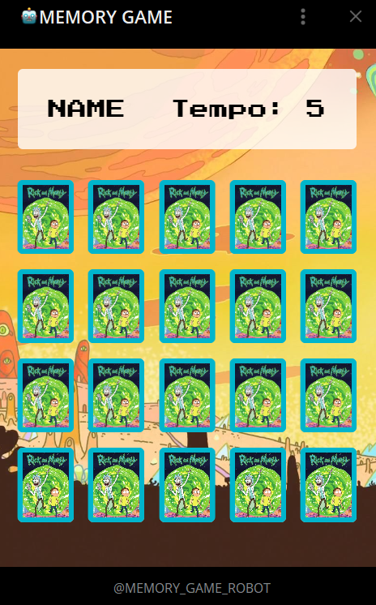

# MEMORY GAME
🎮ESTE É UM BOT DE TELEGRAM QUE OFERECE AOS USUÁRIOS UM LINK DE ACESSO AO MINI-APP PARA JOGAR UM JOGO DA MEMÓRIA.

 <br>
 <br>

## DESCRIÇÃO
Este é um bot do Telegram que oferece aos usuários uma interface simples e prática para acessar um jogo interativo de memória, hospedado como um `MINI-APP`. Ao iniciar o bot com o comando `/start`, o usuário recebe uma saudação amigável, junto a um botão inline rotulado como "🎮JOGAR", que o direciona diretamente para o Mini-App, onde poderá desfrutar do jogo de memória. Este Mini-App é acessível por meio de um navegador, garantindo que o usuário possa jogar em dispositivos móveis ou desktop, sem a necessidade de instalação de aplicativos adicionais.

## FUNCIONALIDADES:
1. **Saudação e Link para o Jogo**:
   - Ao enviar o comando `/start`, o bot responde com uma mensagem de boas-vindas, incluindo um botão inline com o texto **"🎮JOGAR"**.
   - Ao clicar neste botão, o usuário é redirecionado para o link onde o jogo da memória está hospedado, proporcionando uma experiência de jogo imediata e sem complicações.

2. **Ajuda**:
   - O comando `/help` fornece aos usuários acesso a links úteis relacionados ao projeto. A mensagem inclui três botões inline:
     - **🧑‍💻CRIADOR**: Direciona para o perfil do criador do bot no Telegram, permitindo que os usuários entrem em contato.
     - **📢CANAL**: Redireciona para o canal do Telegram associado ao bot, onde os usuários podem acompanhar atualizações e novidades.
     - **🐱FONTE**: Oferece um link para o repositório do código-fonte no GitHub, permitindo que os usuários visualizem e contribuam para o desenvolvimento do bot.

3. **Acessibilidade e Facilidade de Uso**:
   - O bot foi projetado para ser intuitivo, garantindo que usuários de todas as idades possam interagir facilmente com ele.
   - A interface do Mini-App é otimizada para dispositivos móveis e desktops, assegurando uma experiência de jogo fluida e agradável.

## EXECUTANDO O PROJETO:
1. **Configurar suas credenciais**:
   - **Ativar o Mini-App**: Acesse o [@BotFather](https://t.me/BotFather) e envie o comando `/newapp` para criar um novo Mini-App. Siga as instruções fornecidas e, depois de configurado, envie o comando `/mybots`. Selecione o seu bot, vá para **Bot Settings** > **Configure Mini App** > **Enabled**, e insira a URL do seu jogo.
   - **Inserir o Token do Bot**: Antes de rodar o bot, substitua o token do seu bot no arquivo `./CODIGO/CONFIG.py`, na seção `TOKEN`. Você pode obter o token através do [@BotFather](https://t.me/BotFather) ao criar o bot.
   - **Definir a URL do Mini-App**: Abra o arquivo `./CODIGO/CONFIG.py`, e na seção `MINI_APP_URL`, insira a URL onde o seu jogo está hospedado. No exemplo fornecido, eu usei o [JOGO DA MEMÓRIA](https://github.com/VILHALVA/JOGO-DA-MEMORIA) como Mini-App. Esse jogo também está disponivel no [SITE STYLER](https://vilhalva.github.io/STYLER/index.html).

2. **Instalando as dependências:**
   - Certifique-se de instalar todas as dependências necessárias. No terminal, execute o seguinte comando para instalar as dependências listadas no arquivo `requirements.txt` em `CODIGO`:
   ```bash
   pip install -r requirements.txt
   ```

3. **Inicie o Bot:**
   - Execute o bot do Telegram em Python iniciando-o com o seguinte comando:
   ```bash
   python MAIN.py
   ```

4. **Uso do bot:**
   1. **Iniciar o Bot**:
      - Procure pelo bot no Telegram e inicie uma conversa.
      - Digite `/start` para receber a saudação e o botão de acesso ao jogo.

   2. **Acessar o Jogo**:
      - Clique no botão **"🎮JOGAR"** para ser redirecionado ao jogo da memória.

   3. **Obter Ajuda**:
      - Caso tenha dúvidas ou precise de assistência, digite `/help` para acessar informações úteis e suporte.

## NÃO SABE?
- Entendemos que para manipular arquivos em muitas linguagens e tecnologias relacionadas, é necessário possuir conhecimento nessas áreas. Para auxiliar nesse aprendizado, oferecemos alguns subsidios:
* [CURSO DE TELEBOT](https://github.com/VILHALVA/CURSO-DE-TELEBOT)
* [CURSO DE PYTHON](https://github.com/VILHALVA/CURSO-DE-PYTHON)
* [CONFIRA MAIS CURSOS](https://github.com/VILHALVA?tab=repositories&q=+topic:CURSO)

## CREDITOS:
- [PROJETO CRIADO PELO VILHALVA](https://github.com/VILHALVA)
- [ACESSE AO BOT](https://t.me/MEMORY_GAME_ROBOT)
