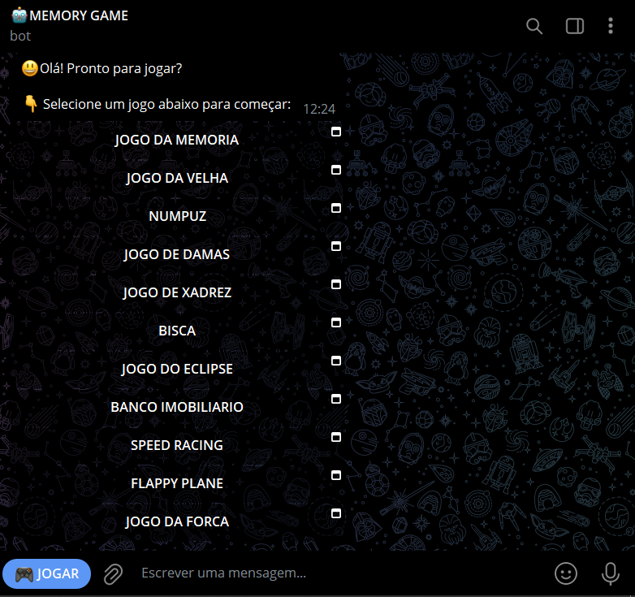

# MEMORY GAME
🎮ESTE É UM BOT DE TELEGRAM QUE OFERECE AOS USUÁRIOS ACESSO A DIVERSOS JOGOS, ATRAVÉS DO RECURSO DE MINI-APPS.

 <br>

## DESCRIÇÃO
Este é um bot do Telegram que oferece aos usuários uma interface simples e prática para acessar uma variedade de jogos interativos hospedados como `MINI-APPS`. Ao iniciar o bot com o comando `/start`, o usuário recebe uma saudação amigável, juntamente com uma lista de botões inline que oferecem diferentes opções de jogos. Cada botão direciona o usuário diretamente ao jogo correspondente, permitindo que ele desfrute de uma experiência divertida e imersiva em diferentes tipos de jogos, diretamente no navegador, seja em dispositivos móveis ou desktops, sem a necessidade de instalação de aplicativos adicionais.

## FUNCIONALIDADES:
1. **Saudação e Seleção de Jogos**:
   - Ao enviar o comando `/start`, o bot responde com uma mensagem de boas-vindas e apresenta uma lista de botões inline, cada um representando um jogo disponível.
   - Ao clicar em qualquer um dos botões, o usuário é redirecionado para o link onde o jogo escolhido está hospedado, proporcionando uma experiência de jogo imediata e sem complicações.

2. **Ajuda**:
   - O comando `/help` fornece aos usuários acesso a links úteis relacionados ao projeto. A mensagem inclui três botões inline:
     - **🧑‍💻CRIADOR**: Direciona para o perfil do criador do bot no Telegram, permitindo que os usuários entrem em contato.
     - **📢CANAL**: Redireciona para o canal do Telegram associado ao bot, onde os usuários podem acompanhar atualizações e novidades.
     - **🐱FONTE**: Oferece um link para o repositório do código-fonte no GitHub, permitindo que os usuários visualizem e contribuam para o desenvolvimento do bot.

3. **Acessibilidade e Facilidade de Uso**:
   - O bot foi projetado para ser intuitivo, garantindo que usuários de todas as idades possam interagir facilmente com ele.
   - A interface dos Mini-Apps é otimizada para dispositivos móveis e desktops, assegurando uma experiência de jogo fluida e agradável, com fácil acesso a diferentes opções de jogos.

## EXECUTANDO O PROJETO:
1. **Configurar suas credenciais**:
   - **Inserir o Token do Bot**: Antes de rodar o bot, substitua o token do seu bot no arquivo `./CODIGO/CONFIG.py`, na seção `TOKEN`. Você pode obter o token através do [@BotFather](https://t.me/BotFather) ao criar o bot.
   - **Definir a URL do Mini-App**: Abra o arquivo `./CODIGO/CONFIG.py`, e na seção `GAMES`, insira o titulo e a URL onde os seus jogos estão hospedados. Nesse exemplo, eu usei os seguintes jogos:
      * [JOGO DA MEMÓRIA](https://github.com/VILHALVA/JOGO-DA-MEMORIA)
      * [JOGO DA VELHA](https://github.com/VILHALVA/JOGO-DA-VELHA-HTML) 
      * [NUMPUZ](https://github.com/VILHALVA/JOGO-DO-NUMPUZ)
      * [JOGO DE DAMAS](https://github.com/VILHALVA/JOGO-DE-DAMAS)
      * [JOGO DE XADREZ](https://github.com/VILHALVA/JOGO-DE-XADREZ)
      * [BISCA](https://github.com/VILHALVA/JOGO-DO-BISCA)
      * [JOGO DO ECLIPSE](https://github.com/VILHALVA/JOGO-DO-ECLIPSE)
      * [BANCO IMOBILIARIO](https://github.com/VILHALVA/BANCO-IMOBILIARIO)
      * [SPEED RACING](https://github.com/VILHALVA/SPEED-RACING)
      * [FLAPPY PLANE](https://github.com/VILHALVA/FLAPPY-PLANE-COM-CONSTRUCT)
      * [JOGO DA FORCA](https://github.com/VILHALVA/JOGO-DA-FORCA-EM-HTML)
   - Para que o botão `Web App` funcione (É o botão que fica ao lado esquerdo do campo de digitação de mensagem no bot, que aparece logo ao lado do ícone do teclado), abra o `./CODIGO/MAIN.py` e modifique o trecho na linha `8` com o titulo do seu jogo:
   ```python
    web_app_info = WebAppInfo(url=GAMES["JOGO 1"])  # Usar uma URL de um jogo específico.
   ```
   - Esses jogos também estão disponiveis no [SITE STYLER](https://vilhalva.github.io/STYLER/index.html).

2. **Instalando as dependências:**
   - Certifique-se de instalar todas as dependências necessárias. No terminal, execute o seguinte comando para instalar as dependências listadas no arquivo `requirements.txt` em `CODIGO`:
   ```bash
   pip install -r requirements.txt
   ```

3. **Inicie o Bot:**
   - Execute o bot do Telegram em Python iniciando-o com o seguinte comando:
   ```bash
   python MAIN.py
   ```

4. **Uso do bot:**
   1. **Iniciar o Bot**:
      - Procure pelo bot no Telegram e inicie uma conversa.
      - Digite `/start` para receber uma saudação amigável e uma lista de botões que dão acesso a diferentes jogos.

   2. **Acessar um Jogo**:
      - Selecione um dos jogos disponíveis, clicando no botão correspondente.
      - Você será redirecionado diretamente ao Mini-App do jogo selecionado, onde poderá jogar imediatamente.

   3. **Obter Ajuda**:
      - Caso tenha dúvidas ou precise de assistência, digite `/help` para acessar informações úteis, como o perfil do criador, canal do Telegram e link para o código-fonte.

## NÃO SABE?
- Entendemos que para manipular arquivos em muitas linguagens e tecnologias relacionadas, é necessário possuir conhecimento nessas áreas. Para auxiliar nesse aprendizado, oferecemos alguns subsidios:
* [CURSO DE TELEBOT](https://github.com/VILHALVA/CURSO-DE-TELEBOT)
* [CURSO DE PYTHON](https://github.com/VILHALVA/CURSO-DE-PYTHON)
* [CONFIRA MAIS CURSOS](https://github.com/VILHALVA?tab=repositories&q=+topic:CURSO)

## CREDITOS:
- [PROJETO CRIADO PELO VILHALVA](https://github.com/VILHALVA)
